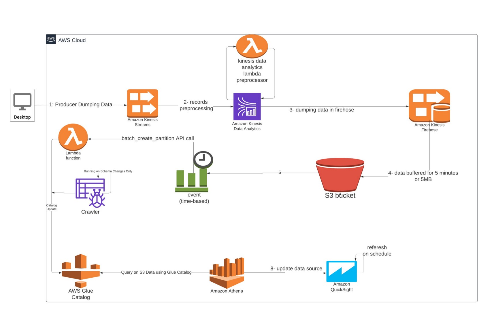

# aws-kinesis-poc

https://www.youtube.com/watch?v=MELPeni0p04




## Solution 1:

```
Chicago Dataset -> 
Kinesis Agg -> 
Kinesis Data Stream -> 
  KPL formated data -> 
  Lambda ->
  CSV/JSON formated ->
  Kinesis Data Analytics -> 
    SQL Tumbling windo ->
    Kinesis Firehouse -> 
    S3 -> 
      Glue Catalog -> 
      Athena -> 
        QucikSight
```

1. Log into [AWS console](https://ap-south-1.console.aws.amazon.com/kinesis/home) and create Kinesis Data Stream
2. [Producer](src/gyan42/streaming/producer.py)
   - [Google Protobuf](https://developers.google.com/protocol-buffers/docs/pythontutorial)
   - [KPL](https://pypi.org/project/aws-kinesis-agg/) 
3. Read about [Kinesis Lambda PreProcessing](https://docs.aws.amazon.com/kinesisanalytics/latest/dev/lambda-preprocessing.html)
4. [Lambda function](src/gyan42/streaming/lambda_preprocessor.py)
   - https://docs.aws.amazon.com/lambda/latest/dg/python-package-create.html
5. AWS Kinesis Analytics
   - [SQL](src/gyan42/streaming/kinesis_tumbling_window.sql)
6. AWS Firehouse
    - year=!{timestamp:yyyy}/month=!{timestamp:MM}/day=!{timestamp:dd}/hour=!{timestamp:HH}/
    - year=!{timestamp:yyyy}/month=!{timestamp:MM}/day=!{timestamp:dd}/hour=!{timestamp:HH}/!{firehose:error-output-type}
7. Glue Crawler
8. Athena   
8. Glue Lambda https://docs.aws.amazon.com/AmazonCloudWatch/latest/events/RunLambdaSchedule.html
```
    cd lambda-preprocessing/
    pip install --target ./package aws_kinesis_agg==1.1.7
    cd package
    zip -r ../lambda-kinesis-preprocessing.zip .
    cd ..
    zip -g lambda-kinesis-preprocessing.zip lambda_function.py
    # Note I reused the rolw which got created in previous trials basically it is AWSLambdaBasicExecutionRole
    aws lambda create-function --function-name lambda-kinesis-preprocessing --zip-file fileb://lambda-kinesis-preprocessing.zip --handler lambda_function.main --runtime python3.8 --role arn:aws:iam::014521883827:role/service-role/mageswaran-kinesis-kpl-preprocessing-lambda-role-mmdfpmaw
```
5. Glue
  - [Catalog](src/gyan42/streaming/glue_catalog.py)

```
S3 In Paths: 
s3://{bucket}/kinesis/data/ingestion/preprocessed/
```

## How to run?
```
 # edit config/producer.gin
 python src/gyan42/streaming/producer.py 
```

## References:
- https://medium.com/swlh/serverless-data-lake-storing-and-analysing-streaming-data-using-aws-60cf3bfe1efd
- https://towardsdatascience.com/a-complete-guide-on-serverless-data-lake-using-aws-glue-athena-and-quicksight-3a8a24cfa4af  
- AWS : https://docs.aws.amazon.com/kinesisanalytics/latest/dev/app-hotspots-detection.html
    - Create Stream Producer: https://docs.aws.amazon.com/kinesisanalytics/latest/dev/app-hotspots-prepare.html
    - Create Analytics App: https://docs.aws.amazon.com/kinesisanalytics/latest/dev/app-hotspot-create-app.html
    - AWS Stream SQL:
        - https://docs.aws.amazon.com/kinesisanalytics/latest/dev/streams-pumps.html
        - https://docs.aws.amazon.com/kinesisanalytics/latest/sqlref/analytics-sql-reference.html

- https://blog.sqreen.com/streaming-data-amazon-kinesis/

## Dataset
- https://www.kaggle.com/currie32/crimes-in-chicago
  - Download and extract data to `data/` folder
      ```
        data/
        ├── archive.zip
        ├── Chicago_Crimes_2001_to_2004.csv
        ├── Chicago_Crimes_2005_to_2007.csv
        ├── Chicago_Crimes_2008_to_2011.csv
        └── Chicago_Crimes_2012_to_2017.csv

      ```
  - Contains data frm 2001 to 2017 ~ 6M records

